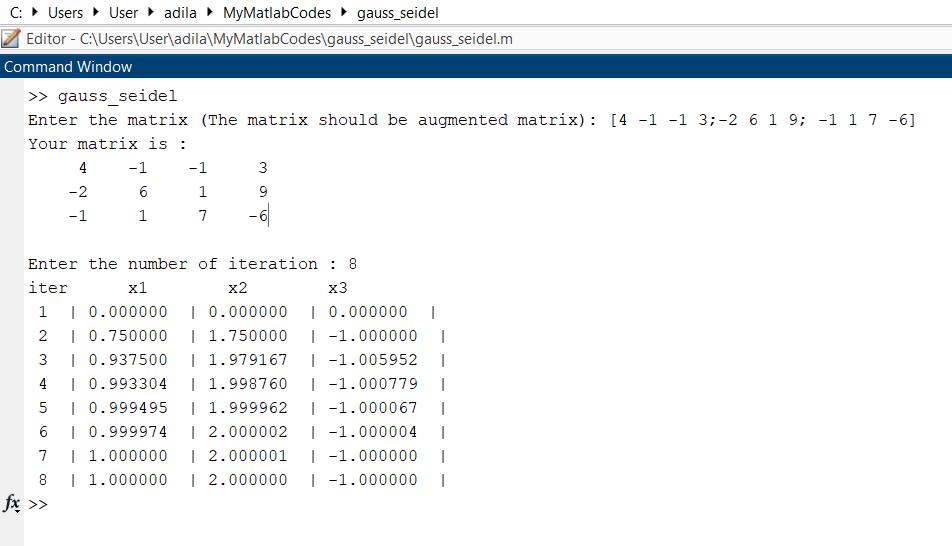

# FIND SOLUTION OF THE SYSTEM OF EQUATION WITH GAUSS-SEIDEL METHOD
Although matlab itself has ready-made functions, it is written for people who want to understand logic or just do the homework given by the teacher like me.

## How to RUN :

-  First make sure you are on the right path.

-  Now all you have to do is type "gauss_seidel" in the command window.
Then write any matrix and see the result.

 
