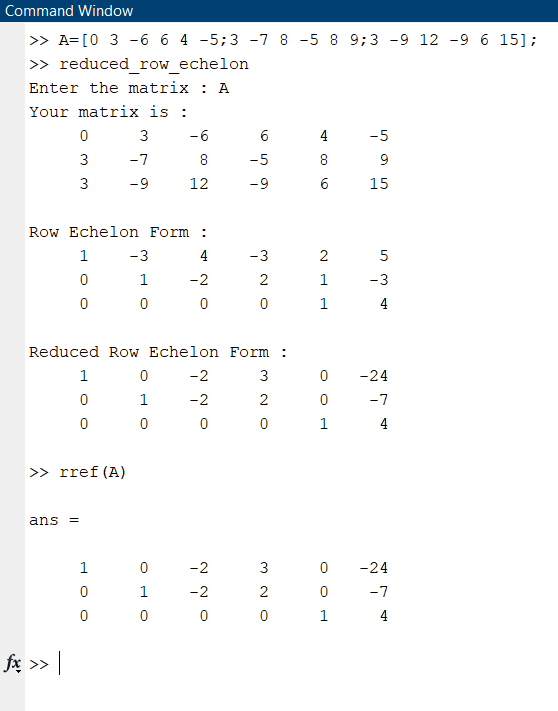

# FIND REDUCED ROW ECHELON FORM OF MATRIX 

Although matlab itself has ready-made functions, it is written for people who want to understand logic or just do the homework given by the teacher like me.

There is a ready command for this in matlab.For example,
find the reduced row echelon form of the A matrix :
```
rref(A);
```

## How to RUN :

-  First make sure you are on the right path.

 

-  Now all you have to do is type "reduced_row_echelon" in the command window.
Then write any matrix and see the result.

 

 ## Note : Partial Pivoting applied.