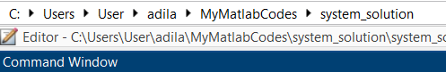
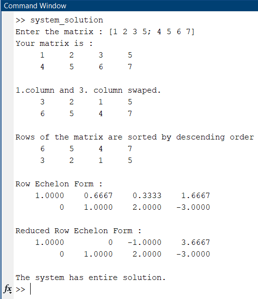

# FIND REDUCED ROW ECHELON FORM, ROW ECHELON FORM and SOLUTION SET  OF MATRIX 

Although matlab itself has ready-made functions, it is written for people who want to understand logic or just do the homework given by the teacher like me.

## How to RUN :

-  First make sure you are on the right path.

 

-  Now all you have to do is type "system_solution" in the command window.
Then write any matrix and see the result.

 

 ## Note : Complete Pivoting applied.